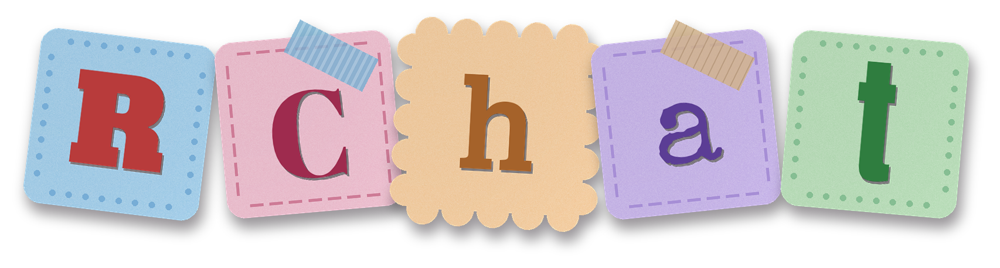

<p align="center">
  
</p>

<p align="center">
  <a href="https://github.com/RobbyV2/RChat/actions/workflows/ci.yml"></a>
  <a href="https://github.com/RobbyV2/RChat/pkgs/container/rchat"></a>
  
  
  
</p>

# RChat

Anonymous chat with a Discord-style layout and Google Material 3 dark theme. Servers, channels, and direct messages update live over a WebSocket. Everything runs locally; no external APIs, no telemetry, no email.

## Setup

Prerequisites: Rust (stable), Bun, wasm-pack, and the just command runner.

```bash
cp .env.local.example .env.local
just src install
just src dev
```

Fill out `.env.local` after renaming; the defaults work as-is for local development. Open http://localhost:3000. The first account registered becomes the hidden site admin.

Production: `just src prod`. API-only backend: `just src api`.

## Deployment modes

- Full (default): one Rust server on port 3000 serves `/api` and proxies everything else to the Next.js server. `just src prod`.
- Split: run the Rust API headless anywhere with `APP_MODE=api-only`, and deploy the frontend as a static site baked with that API's URL. The static bundle talks to the API over CORS and connects its WebSocket to the same host, so the two halves can live on different origins.

```bash
# on the API host (no UI, serves only /api)
APP_MODE=api-only just src api

# build the static frontend against that API (outputs to out/)
just src build-static https://api.your-host.com
# or preview it locally: just src static https://api.your-host.com
```

The static build inlines `NEXT_PUBLIC_API_URL`; every request and the WebSocket target it directly. `out/` is plain files for any static host (an `index.html` copy is written to `404.html` so deep links like `/s/rchat/1/` boot the app). Guest and public-server browsing work cross-origin; authenticated media loaded via `` needs the API on the same site or a public server, since image tags cannot send the bearer token.

Docker (nightly image, published by CI and matching the `nightly` git tag):

```bash
docker run -p 3000:3000 -v rchat-data:/data ghcr.io/robbyv2/rchat:nightly
```

Or `docker compose up` to build locally.

## Architecture

- `src/` is a Rust axum server on port 3000. It serves everything under `/api` and proxies all other paths to the Next.js dev or standalone server on port 3001.
- `app/` is a Next.js 16 app router frontend with Tailwind 4, zustand for state, react-markdown for message rendering, and lucide-react icons. Material 3 color tokens live as CSS variables in `app/globals.css`.
- Storage is sqlx over sqlite or postgres, selected by `DATABASE_URL`: a `postgres://` URL uses postgres, anything else is treated as a sqlite file path (WAL mode), default `rchat.db`. Users, tokens, servers, channels, members, messages, and media blobs all live in the database. MongoDB is not supported (no single Rust library covers it alongside SQL backends).
- `/api/ws` is a broadcast hub. Handlers write to the database, then broadcast typed events (messages, channel and server changes, membership, presence, bans, media removal). Each connection filters events to its member servers, guest subscriptions, and DMs.
- Presence is per server: a user is online only in the single server they are currently viewing.
- Rate limiting is per IP via tower_governor across `/api`, with a stricter layer on auth and media routes. A 60 second background task sweeps expired media.
- Profanity filtering (rustrict) runs server-side on usernames, server display names, channel names, and channel messages. DMs and passwords are exempt.
- The `wasm/` crate and `jfiles/` recipes are retained template infrastructure.

## Deliberate non-industry choices

These are intentional per the project spec. Site-level protections exist (per-IP rate limits, server-side validation); user-level protections are deliberately loose.

- No password rules. Any non-empty password is accepted, including a single character. There is no strength meter and no minimum length.
- Deterministic word passwords. As an alternative to text passwords, each username maps to a fixed set of 20 words: sha256 of the lowercase username seeds a ChaCha8 RNG that samples the `memorable-wordlist` crate. The user picks 7 of those 20 in order. Anyone can request any username's word set at `GET /api/auth/words/{username}`; the secret is the ordered selection, not the set.
- Unlimited but throttled logins. There is no attempt cap and no lockout on failures. Per username: attempts must be 3 seconds apart, and more than 1000 attempts in one day lock the account until the next day.
- Anonymous accounts. No email, no phone, no recovery flow. Usernames accept any characters. A lost password means a lost account.
- Unencrypted single sqlite file by default. All data, including uploaded file blobs, lives in one unencrypted `.db` file (or a postgres database via `DATABASE_URL`). Anyone with the file has everything.
- Public identifiers. Lowercased usernames are user IDs. Lowercased server names are server IDs and also the invite codes; knowing a server's name is sufficient to join or view it.
- Hidden site admins. The first registered account is the site admin. No badge or indicator reveals this anywhere; admin-only routes return 404 rather than 403 to non-admins so the panel's existence stays hidden.
- One-day media retention. Uploads are capped at 25MB and deleted exactly one day after posting. The message remains and renders a notice that the file was removed.
- Guest read-only access. A "Skip to RChat" button on the login page enters a guest mode with no account. Guests can view any server by name (their server list is kept in localStorage), receive live updates, and cannot send messages or appear in presence.
- Non-expiring tokens. Login tokens are random 32-byte values that never expire.

## Configuration

Environment variables, loaded from `.env.local` and `.env` (see `.env.local.example`): `APP_MODE` (full or api-only), `HOST`, `SERVER_PORT`, `PORT`, `DATABASE_URL`, `RATE_LIMIT_PER_SECOND`, `RATE_LIMIT_BURST`, `S3_ENDPOINT`, `S3_BUCKET`, `S3_ACCESS_KEY`, `S3_SECRET_KEY`, `S3_REGION` (optional, default us-east-1; setting the other four S3 vars stores media blobs in the S3-compatible bucket at `media/{id}` instead of the database, path-style so minio works).
